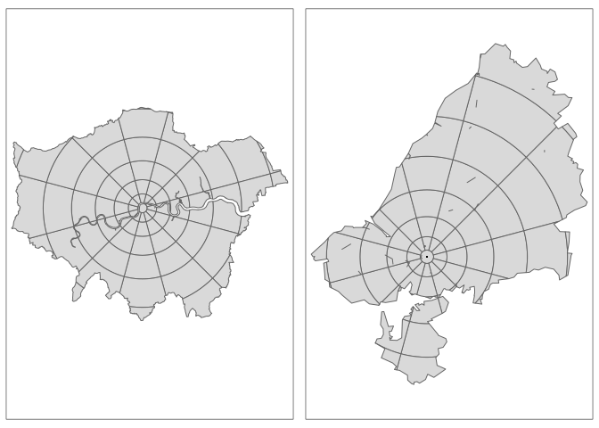

Development of a prototype web application for active transport planning
================

<!-- README.md is generated from README.Rmd. Please edit that file -->

# Summary

This document provides an overview of the third phase of work for the
WHO’s Urban Health Initiative, and the ongoing development of a web
application to explore health benefits of different sustainable
transport policies, with the working title of the Urban Planning and
Transport Health Assessment Tool (Upthat; R Lovelace et al. 2018), which
was previously named the Active Transport Toolkit (ATT). **The main
output is be a stable prototype, enabling interactive exploration of
active transport scenarios and associated health impacts.** The work
builds on previous projects funded by the WHO (in grants 2017/773067 and
2017/773067-0). Upthat can be used for many purposes related to the
interface between transport and human health, including assessment of
exposure to air pollution, changes in the distribution of physical
activity, and the spatial distribution of cycling and and walking.

The driving aim of this project across all stages was to create a
*flexible framework* for analyzing, visualizing and testing a range of
scenarios based on different input datasets and parameters, and to
ensure the framework is able to be updated and modified at any stage
within or beyond the project timetable as desired. We have delivered
that in the form of open source software, the R package `upthat`, which
users can install and adapt for their own use cases.

# Introduction

This builds on prior work, notably the Propensity to Cycle Tool (PCT)
project (Lovelace et al. 2017). The PCT has become the primary
government endorsed cycle network planning tool in the UK and is being
used by dozens of transport planning organizations to improve the
effectiveness of hundreds of km of cycleway schemes. The international
application of these methods can be supported by new high performace
software. This ‘software ecosystem’ includes `dodgr`, an R package for
shortest path calculation on spatial networks (Padgham 2019), `stplanr`,
an R package for processing origin-destination data (Robin Lovelace and
Ellison 2018), data access packages such as `pct` and `stats19` and
interfaces to routing services such as `rosm` and `opentripplanner`.
**The general applicability of such software raises the possibility of a
globally scalable tool for sustainable transport planning, if only a
user interface existed which did not require specialist programming
skills. Follow-up work will seek funding for such a global tool.**

The prototype web application we developed for this project works at the
city level, where city authorities have substantial power in many
countries. The case study cities were Accra (Ghana), Kathmandu (Nepal)
and Bristol (UK). Beyond the generation of an interactive web
application, a key research outcome is exploration of methods to convert
open data into estimates of transport behaviour down to the street
level, and resulting health impacts. The framework enables comparison of
multiple scenarios in health-economic terms building on health modelling
projects such as the Health Economic Assessment Tool (HEAT Kahlmeier et
al. 2014) using locally-provided data.

# Methods

## Spatial network analysis

The previous two phases of this work established and calibrated methods
to generate “flow layers” from a range of origins to trip attracting
destinations, defined by the type of trip (work, education, etc). Each
layer is calculated in two directions (origin \(\rightarrow\)
destination; destination \(\rightarrow\) origin):

| origin | destination | mode             |
| :----- | :---------- | :--------------- |
| home   | work        | bicycle foot     |
| home   | education   | bicycle foot     |
| home   | retail      | bicycle foot     |
| home   | bus         | foot             |
| work   | retail      | bicycle foot     |
| work   | bus         | foot             |
| retail | bus         | foot             |
| retail | retail      | foot bicycle bus |

In the second stage, *relative* density along each street segment was
calculated as follows:

1.  Home densities were estimated directly from population density layer
    (enabling subsequent finer distinctions between demographic groups)

2.  Work densities were based on data on “activity centres” (centres of
    commerce, administration, education), scaled by estimated building
    sizes.

<!-- I don't think we've don this yet... (RL) -->

<!-- (including floor areas times height where available), modified for distinct purposes such that, for example, densities for journeys to educational facilities are high for purposes of education, yet lower for purposes of employment. -->

<!-- 3. Educational trip attractor densities were based on open data on schools, colleges and universities. -->

3.  Retail densities based on local densities and sizes of retail
    buildings.

<!-- All of these densities are also adjusted via a model of the spatial patterns of -->

<!-- bus usage which estimates aggregate rates of ingress -- densities entering buses at each stop -- and egress -- densities exiting buses at each stop. -->

<!-- The model used to estimate these rates of ingress and egress has been calibrated against open data from the. -->

The layers were generated in isolation, with associated levels of
uncertainty, but can be combined converting relative flows into absolute
flows and then combining the trip counts for each layer at a given level
of temporal resolution (daily, on week days, in the first instance).
<!-- A trial weighting scheme for a master walking layer was developed for Accra based on statistics for proportions of walking trips for different purposes, and for frequencies of bus usage. -->
<!-- Phase 3 will involve calculating absolute flows and validating these against a range of data sources, including the [Minnesota Transit Survey](https://gisdata.mn.gov/dataset/us-mn-state-metc-trans-stop-boardings-alightings), Transport for London's cycle [traffic count data](http://roads.data.tfl.gov.uk/) and the UK Census. -->

## Air pollution

A spatial model of air pollution was explored with the aim of enabling
the automatic creation of pollution heat maps, building on prior methods
such as Vara-Vela et al. (2016). Most prior methods, including the
[Praise Hong Kong Air-Monitoring App](https://praise.ust.hk), rely on
coarse estimates of street network structure to provide crude estimates
of vehicular densities. We will model air quality at relatively high
resolution, including estimated rates of dispersion away from the
street-based sources.
<!-- This modelling approach is equivalent to the development on the Praise App proposed for later this year (2019). -->

Estimates of exposure to air pollutants require data on both background
(e.g. due to nearby industry) and spatially explicit sources
(e.g. vehicles on streets). We aimed to combine city-wide background
estimates, to generate estimates of aggregate exposure. Initially aimed
a temporal snapshot of average pollution levels but the possibility of
extending the air pollution component will be built-in. Due to time
constraints and unexpected delays in developing and calibrating spatial
network analysis models, we have not generated new methods of estimating
air pollution heatmaps.

## Origin-destination to route network analysis

A parallel stream of work investigated the application of the methods
used in the PCT project internationally. This involves the following
main stages.

  - The development of spatial interaction models (SIMs) to estimate
    flow. Bristol was used as a case study city to demonstrate a general
    methodology for estimating travel demand between discrete zones in
    the city (see Figure below).
  - The use of routing services such as OpenTripperPlanner to identify
    plausible routes for each OD pair
  - Estimation of mode share for each OD pair and route/mode combination
    currently and under ‘global’ scenarios of change, for example using
    the Dirichlet regression methods outlined in the [adaptation
    manual](https://atfutures.github.io/upthat/articles/adaptation.html#scenarios).
  - Route network generation, to identify the parts of transport
    networks with the highest potential for change, which represent
    promising places for investment in sustainable transport
    infrastructure and other interventions to enable mode shift away
    from cars and towards public transport and active modes.

Additional optional stages, highlighting the flexibility of the
approach, could include the following.

  - The generation of zoning systems for cities where appropriate zoning
    systems are not provided by the local authority in question, this
    stage of the process has be tackled by the development of a new R
    package, `zonebuilder`.
  - The modification of the geographic data from OpenStreetMap used to
    estimate routes and the re-running the mode choice component to
    estimate the mode shift response to ‘local’
interventions.

**Results of observed data (left), unconstrained SIM (middle) and
‘production constrained’ SIM (right)**

# Project stages

Each stage was delivered with reproducible code resulting in open data,
for future research, transparency and validation. The emphasis of this
third phase was the development of a stable prototype application,
building on the experimental software development and proof-of-concept
production focus of phases 1 and 2. As outlined in the next section, the
‘stable application’ will have a dedicated domain and be available for
at least 2 months after completion of the project. The main stages of
the work
were:

<!-- 1. **Analytic Methods and Software** Phase II resulted in a prototype ATT representing patterns of active travel in Accra only.  -->

<!--    This third Phase will apply all previous analyses to Kathmandu, thereby consolidating code and ensuring transferability between locations. -->

1.  **Validation** of estimated travel behaviour and flow estimates
    based on case study cities. The results of this phase are reported
    in a document hosted at <https://github.com/ATFutures/nyped>

2.  **Health integration** of changes in mobility behaviour (densities
    of movement along street segments for a range of journey purposes,
    modes of transport, and demographic factors) into health-economic
    measures, extending from the calibration procedure underlying HEAT.
    The results are reported in the ‘health tab’ of the public facing
    tool hosted at <https://atfutures.github.io/uta/> and described in
    the document hosted at
    <https://github.com/ATFutures/who3/tree/master/health-econ>

3.  **Scenario development**, the definition of policy-facing high-level
    scenarios and their implementation on open datasets on cities
    (possibly supplemented with accessible data on travel behaviour,
    e.g. the percentage of trips made by different modes). The
    description of the high level scenarios is provided in the
    adaptation manual’s Scenarios section:
    <https://atfutures.github.io/upthat/articles/adaptation.html#scenarios>.
    Due to issues with the representation of scenarios of change in
    route network analysis, new methods were developed to estimate
    levels of mode shift in response to such scenarios, although data
    limitations prevented results being generated for the full range of
    scenarios, as outlined in the [‘Modelling mode shift’
    section](https://atfutures.github.io/upthat/articles/adaptation.html#estimates-of-rates-of-shift-towards-walking-and-cycling-down-to-route-network-levels)
    of the adaptation
manual.

<!-- will involve: -->

<!--    (i) setting out high level policy scenarios, including active transport uptake and disincentives to driving; -->

<!--    (ii) converting these changes into estimates of rates of shift towards active transport modes at the origin-destination and route network levels; and -->

<!--    (iii) simulating the impacts of these scenarios on walking and cycling levels citywide. -->

1.  **Prototype app** Concurrent with the preceding two stages, the
    prototype was set-up and served from a stable web location, and will
    be maintained for the duration of the project:
    <https://atfutures.github.io/uta/>

2.  **Health impacts** The output of the previous stages will be
    combined to enable comparison of scenarios in terms of their impact
    on health-economic measures (see the health impacts tab)

3.  **User manual**, based loosely on the HEAT tool manual, to be used
    by non experts in case study cities. The manual will allow local
    stakeholders to understand, utilize, and provide feedback on the
    tool (see the [Upthat user manual hosted at
    atfutures.github.io/upthat](https://atfutures.github.io/upthat/articles/upthat.html)
    )
    <!-- As stated above, the tool itself will be web-based, and this usual manual will presume as little computer expertise as possible, and should be intelligible to an entirely general audience. -->

4.  [**Adaptation
    manual**](https://atfutures.github.io/upthat/articles/adaptation.html),
    which serves the dual purpose of describing
    
    1)  How Upthat may be adapted and applied to other, additional
        locations; and in doing so,
    2)  How Upthat as presented to each location may be adapted and
        modified following feedback from local
stakeholders.

<!-- This manual will detail in general, non-technical terms, the nature of inputs, analytic processes, and resultant outputs, to enable stakeholders to readily identify modifications that might ultimately provide outputs better suited to local needs, desires, and future visions. Particularly important will be a section describing the quality of results in cases where *no* local data are able to be provided, along with a brief catalogue of increases in accuracy resulting from supplementing generic global-scale data with more detailed local data. -->

# Deliverables

The status of each deliverable is outlined below, with wording from the
contract in bullet points and comments under each.

  - Deliverable 1 (linked to output 1). Health integration: This stage
    will involve converting metrics of mobility (densities of movement
    along street segments for a range of journey purposes, modes of
    transport, and demographic factors) into health-economic measures,
    for example by building on HEAT, with input from UHI and HEAT
    development team.

This has been delivered, described in a report in the [health-econ
folder in the who3
repo](https://github.com/ATFutures/who3/tree/master/health-econ).

  - Deliverable 2 (linked to output 1). Scenario development: This stage
    will involve: (1) setting out high level policy scenarios of active
    transport uptake; (2) converting these changes into estimates of
    rates of shift towards walking and cycling down to route network
    levels; and (3) simulating the impacts of these scenarios on walking
    and cycling levels citywide. Scenario development will also be
    strongly informed by the transport scenarios assessed in Accra and
    Kathmandu as part of UHI project activities.

This has been done, with additional unexpected work done to develop new
methods for converting scenarios of change into estimates of mode shift,
with explicit consideration of uncertainty (see the [Scenarios section
of the Adaptation
Manual](https://atfutures.github.io/upthat/articles/adaptation.html#scenarios)).
- Deliverable 3 (linked to output 1). Health impacts: the output of the
previous stages will be combined to enable comparison of scenarios,
extending from the calibration procedure underlying HEAT and other
methods used in similar tools, such as the Propensity to Cycle Tool.

This has been delivered in the Health Impacts tab on the tool. As
discussed in issue [38](https://github.com/ATFutures/upthat/issues/38),
we plan to make this interactive in follow-on work. The spatial network
modelling approach did not respond as expected to changes in scenarios,
hence static results. Furthermore, we plan to integrate outputs from the
model with existing open source components in published health models
such as HEAT and ITHIM (Woodcock, Givoni, and Morgan 2013).

  - Deliverable 4 (linked to output 1). Draft prototype webtool:
    concurrent with the preceding two stages, the prototype webtool will
    be set-up and served from a stable web location and will be
    maintained for the duration of the project. This stage includes the
    search and update of relevant datasets, coding and thorough
    documentation of the development process.

Done, a stable and publicly accessible tool is available at
<https://atfutures.github.io/uta/>

  - Deliverable 5 (linked to outputs 2 and 3). Draft background text and
    supporting documentation for users, with information on the tool,
    including methods used, key references and sources of data and
    information, and guidance on how to use and interpret results. The
    manual will presume as little computer expertise as possible, and
    should be intelligible to a general audience. Users’ manual annex
    will include detailed text on the methodology used for each of the
    tools components, which will serve as the basis for the academic
    paper.

Done, the calibration manuscript has been submitted:
<https://github.com/ATFutures/who3/tree/master/calibration>

  - Deliverable 6 (linked to outputs 2 and 3). Draft background text and
    supporting documentation for adaptation of the tool to other cities,
    with information on adaptations on the data and datasets used, code
    and scenarios, and guidance on key elements to consider when
    adapting the tool to other contexts. This adaptation guidance will
    inform the development of the academic paper and serve the dual
    purpose of describing (i) How the tool may be adapted and applied to
    other, additional locations; and in doing so, (ii) how the tool as
    presented to each location may be adapted and modified following
    feedback from local stakeholders.

Done, see these two manuals:
<https://atfutures.github.io/upthat/articles/upthat.html>
<https://atfutures.github.io/upthat/articles/adaptation.html> plus the
[calibration
manuscript](https://github.com/ATFutures/who3/tree/master/calibration).

<!-- # Deliverables 2 -->

<!-- The primary deliverables extending from each of the above phases are: -->

<!-- 1. **Analytic Methods and Software** This phase will not produce any concrete deliverables, but will provide for both cities the necessary input data to allow the development of individually adapted ATT. -->

<!-- 1. **Health Integration** This stage will enable ATT output to be expressed in health-economic terms. -->

<!--    As the third stage are conducted concurrently with these first two, the output of this stage are directly viewable in the ATT. -->

<!-- 1.  **Prototype web app** which will work for multiple cities and allow visualization of transport and health outcomes under a range of scenarios. This is hosted at a dedicated URL and be available for at least 2 months after the project is complete: https://atfutures.github.io/uta/ -->

<!-- 1.  **A description of scalable scenarios**, which will be encoded, quantified, and provided in a form that can be applied to other cities: https://atfutures.github.io/upthat/articles/adaptation.html#scenarios -->

<!-- Plausible scenarios of change will include those with the following working titles: -->

<!--     - 'Get walking', referring to a global (meaning without spatial input components, but with spatially distributed consequences) walking uptake, as a result of citywide policies to promote safe and attractive walking. -->

<!--     - 'Get cycling', referring to a global scenario of cycling, as a result of citywide policies to provide safe cycleways. -->

<!--     - 'Car diet', a global, citywide scenario of multi-modal transport change, showing reduced levels of driving following disincentives to own and use cars. -->

<!--     - 'Go public transport', a global scenario of public transport uptake, linked to [SDG 11](https://sustainabledevelopment.un.org/sdg11). -->

<!--     - 'Car free', meaning investment in car free city centers and other spaces, other locally specific scenarios, such as reductions in car parking spaces. -->

<!-- 1. **Health Impacts** This stage will extend the App to include the ability to select and compare scenarios, in terms both of changes in mobility patterns as well as associated health and economic terms. -->

<!-- 1. **User Manual**: https://atfutures.github.io/upthat/articles/upthat.html -->

<!-- 1. **Adaptation Manual**: https://atfutures.github.io/upthat/articles/adaptation.html -->

<!-- We would explore the possibility of creating hybrid scenarios, e.g. with some level of uptake of walking and cycling, to see which interventions are likely to be most effective in each city. -->

# Timeline

In the initial plan the work would be conducted over 4 months, with each
stage taking between 2 weeks to 2 months, as illustrated below.

Due to delays in contracts and unexpected delays in the route network
analysis software development, the contract ran into December 2019.

# Limitations and next steps

During the project limitations with the spatial network analysis method
were identified, which have resulted static estimates of health outcomes
at the city level, rather than the geographically disaggregated
estimates of health impacts that were initially envisaged.

To overcome this limitation, a parallel method using origin-destination
was developed in the final weeks of the project. Due to time
constraints, the method has not been fully implemented for the case
study cities. An advantage of this method is that it allows estimates of
mode shift at the origin-destination level based on realistic data of
trips made. **This would allow geographically disaggregated estimates of
health impacts resulting from global and local scenarios of change.**
Implementing this OD method is a priority next step.

An interesting development that has arisen from research into this ‘OD
approach’ is an automated zoning system that could support city planners
who lack access to appropriate official zones, as the basis of spatial
interaction models. An illustration of this is shown in the figure
below. This method was developed in the final week of the project so has
not been deployed, but we plan explore using such automated zone
generation methods as the basis of future work at the OD level.

**Illustration of automated zoning systems applied to London and
Bristol, a next step could be to apply this to case study cities as the
basis of OD analysis.**

An additional limitation of the work was that the air pollution exposure
has not been deployed as a continuous ‘heatmap’ as expected. Instead,
air pollution estimates based on estimates of vehicular flow have been
developed, but these have not been verified for the case study cities.
Using alternative methods to estimate current and projected future
levels of air pollution, perhaps using [machine learning methods
demonstrated in work by Meng Lu](https://github.com/mengluchu/globalLUR)
of Utrecht University.

We will continue to work on these discrete components of the project in
liaison with the WHO informally.

# References

Kahlmeier, S, P Kelly, C Foster, T Götschi, N Cavill, H Dinsdale, J
Woodcock, C Schweizer, H Rutter, and C Lieb. 2014. “Health Economic
Assessment Tools (HEAT) for Walking and for Cycling, Methods and User
Guide.” *World Health Organization Regional Office for Europe,
Copenhagen, Denmark*, 2014.

Lovelace, R, N Groot, M Adepeju, and M Padgham. 2018. “Estimating
Cycling Potential on Route Networks in Accra and Kathmandu.” World
Health Organization.

Lovelace, Robin, and Richard Ellison. 2018. “Stplanr: A Package for
Transport Planning.” *The R Journal* 10 (2): 7–23.
<https://doi.org/10.32614/RJ-2018-053>.

Lovelace, Robin, Anna Goodman, Rachel Aldred, Nikolai Berkoff, Ali
Abbas, and James Woodcock. 2017. “The Propensity to Cycle Tool: An Open
Source Online System for Sustainable Transport Planning.” *Journal of
Transport and Land Use* 10 (1). <https://doi.org/10.5198/jtlu.2016.862>.

Padgham, Mark. 2019. *Dodgr: An R Package for Network Flow Aggregation*.
Vol. 2. Transport Findings. Network Design Lab.
<https://doi.org/10.32866/6945>.

Vara-Vela, A., M. F. Andrade, P. Kumar, R. Y. Ynoue, and A. G. Muñoz.
2016. “Impact of Vehicular Emissions on the Formation of Fine Particles
in the Sao Paulo Metropolitan Area: A Numerical Study with the WRF-Chem
Model.” *Atmospheric Chemistry and Physics* 16 (2): 777–97.
<https://doi.org/https://doi.org/10.5194/acp-16-777-2016>.

Woodcock, James, Moshe Givoni, and Andrei Scott Morgan. 2013. “Health
Impact Modelling of Active Travel Visions for England and Wales Using an
Integrated Transport and Health Impact Modelling Tool (ITHIM).” *PLoS
ONE* 8 (1). <https://doi.org/10.1371/journal.pone.0051462>.

