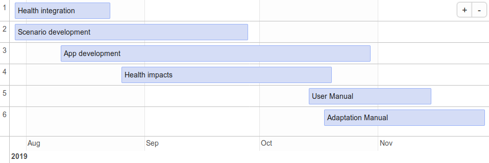

Development of a prototype web application for active transport planning
================

<!-- README.md is generated from README.Rmd. Please edit that file -->

# Introduction

This document sets out a plan for the third phase of work for the WHO’s
Urban Health Initiative, and the ongoing development of a web
application to explore health benefits of different sustainable
transport policies, with the working title of “Active Transport Tool”
(ATT; Lovelace et al. 2018). **The main output will be a stable
prototype, enabling interactive exploration of active transport
scenarios and associated health impacts.** The work will build on
previous projects funded by the WHO (in grants 2017/773067 and
2017/773067-0). The ATT can be used for many purposes related to the
interface between transport and human health, including assessment of
exposure to air pollution, changes in the distribution of physical
activity, and the spatial distribution of cycling and pedestrian flow
densities. These flow densities — quantified as relative densities of
bi-directional movement along each segment of the urban street network —
are calculated for a number of “layers” reflecting distinct journey
purposes and modes (see the following section).

The driving aim of this project across all stages will be to create of a
*flexible framework* for analyzing, visualizing and testing a range of
scenarios based on different input datasets and parameters, and to
ensure the framework is able to be updated and modified at any stage
within or beyond the project timetable as desired. This work will go
beyond the Propensity to Cycle Tool (PCT) project (Lovelace et al.
2017), which has become the primary government endorsed cycle network
planning tool in the UK and is being used by dozens of transport
planning organizations to improve the effectiveness of hundreds of km of
cycleway schemes. The international application of these methods,
supplemented by new high performace software (Padgham and Peutschnig
2017), raises the possibility of a globally scalable tool for
sustainable transport planning. Follow-up work will seek funding for
such a global tool.

The prototype web application we will develop for this project will be
implemented at the city level, however, in Accra, Kathmandu, and at
least one other city. Beyond the generation of an interactive web
application, a key research outcome will be methods to convert transport
flow data into health impacts, and case study cities showcasing this.
This will enable comparison of scenarios under the fourth point below in
health-economic terms, and we will also investigate the feasibility of
calibrating the Health Economic Assessment Tool (HEAT Kahlmeier et al.
2014) using locally-provided data.

# Methods

## Flow layers

The previous two phases of this work established and calibrated methods
to generate “flow layers” from a range of origins to trip attracting
destinations, defined by the type of trip (work, education, etc). Each
layer is calculated in two directions (origin \(\rightarrow\)
destination; destination \(\rightarrow\) origin):

| origin | destination | mode             |
| :----- | :---------- | :--------------- |
| home   | work        | bicycle foot     |
| home   | education   | bicycle foot     |
| home   | retail      | bicycle foot     |
| home   | bus         | foot             |
| work   | retail      | bicycle foot     |
| work   | bus         | foot             |
| retail | bus         | foot             |
| retail | retail      | foot bicycle bus |

In the second stage, *relative* density along each street segment was
calculated as follows:

1.  Home densities were estimated directly from population density layer
    (enabling subsequent finer distinctions between demographic groups)

2.  Work densities were based on data on “activity centres” (centres of
    commerce, administration, education), scaled by estimated building
    sizes.

<!-- I don't think we've don this yet... (RL) -->

<!-- (including floor areas times height where available), modified for distinct purposes such that, for example, densities for journeys to educational facilities are high for purposes of education, yet lower for purposes of employment. -->

<!-- 3. Educational trip attractor densities were based on open data on schools, colleges and universities. -->

3.  Retail densities based on local densities and sizes of retail
    buildings.

<!-- All of these densities are also adjusted via a model of the spatial patterns of -->

<!-- bus usage which estimates aggregate rates of ingress -- densities entering buses at each stop -- and egress -- densities exiting buses at each stop. -->

<!-- The model used to estimate these rates of ingress and egress has been calibrated against open data from the. -->

The layers were generated in isolation, with associated levels of
uncertainty, but can be combined converting relative flows into absolute
flows and then combining the trip counts for each layer at a given level
of temporal resolution (daily, on week days, in the first instance).
<!-- A trial weighting scheme for a master walking layer was developed for Accra based on statistics for proportions of walking trips for different purposes, and for frequencies of bus usage. -->
Phase 3 will involve calculating absolute flows and validating these
against a range of data sources, including the [Minnesota Transit
Survey](https://gisdata.mn.gov/dataset/us-mn-state-metc-trans-stop-boardings-alightings),
Transport for London’s cycle [traffic count
data](http://roads.data.tfl.gov.uk/) and the UK Census.

## Air pollution

A spatial model of air pollution will be created, enabling the automatic
creation of pollution heat maps, building on prior methods such as
(**???**).
Most prior methods, including the [Praise Hong Kong Air-Monitoring
App](https://praise.ust.hk)m, rely on coarse estimates of street network
structure to provide crude estimates of vehicular densities. We will
model air quality at relatively high resolution, including estimated
rates of dispersion away from the street-based sources.
<!-- This modelling approach is equivalent to the development on the Praise App proposed for later this year (2019). -->

Estimates of exposure to air pollutants require data on both background
(e.g. due to nearby industry) and spatially explicit sources
(e.g. vehicles on streets). Spatially explicit estimates will be
combined with city-wide background estimates, to generate estimates of
aggregate exposure. Initially we will provide a temporal snapshot of
average pollution levels but the possibility of extending the air
pollution component will be built-in.

# Project stages

Each stage will be delivered with reproducible code resulting in open
data, for future research, transparency and validation. The emphasis of
this third phase will be on the development of a stable prototype
application, building on the experimental software development and
proof-of-concept production focus of phases 1 and 2. As outlined in the
next section, the ‘stable application’ will have a dedicated domain and
be available for at least 2 months after completion of the project. The
main stages of the work will
be:

<!-- 1. **Analytic Methods and Software** Phase II resulted in a prototype ATT representing patterns of active travel in Accra only.  -->

<!--    This third Phase will apply all previous analyses to Kathmandu, thereby consolidating code and ensuring transferability between locations. -->

1.  **Validation** of estimated travel behaviour and flow estimates
    based on case study cities.

2.  **Health integration** This stage will involve converting metrics of
    mobility (densities of movement along street segments for a range of
    journey purposes, modes of transport, and demographic factors) into
    health-economic measures, extending from the calibration procedure
    underlying HEAT.

3.  **Scenario development** will involve:
    
    1)  setting out high level policy scenarios, including active
        transport uptake and disincentives to driving;
    2)  converting these changes into estimates of rates of shift
        towards active transport modes at the origin-destination and
        route network levels; and
    3)  simulating the impacts of these scenarios on walking and cycling
        levels citywide.

4.  **Prototype app** Concurrent with the preceding two stages, the
    prototype app will be set-up and served from a stable web location,
    and will be maintained for the duration of the project.

5.  **Health impacts** The output of the previous stages will be
    combined to enable comparison of scenarios in terms of their impact
    on health-economic measures.

6.  **User manual**, based loosely on the HEAT tool manual, to be used
    by non experts in case study cities. The manual will allow local
    stakeholders to understand, utilize, and provide feedback on the
    tool.
    <!-- As stated above, the tool itself will be web-based, and this usual manual will presume as little computer expertise as possible, and should be intelligible to an entirely general audience. -->

7.  **Adaptation manual** An “Adaptation Manual” will be developed, to
    serve the dual purpose of describing
    
    1)  How an ATT may be adapted and applied to other, additional
        locations; and in doing so,
    2)  How the ATT as presented to each location may be adapted and
        modified following feedback from local stakeholders.
    
    This manual will detail in general, non-technical terms, the nature
    of inputs, analytic processes, and resultant outputs, to enable
    stakeholders to readily identify modifications that might ultimately
    provide outputs better suited to local needs, desires, and future
    visions. Particularly important will be a section describing the
    quality of results in cases where *no* local data are able to be
    provided, along with a brief catalogue of increases in accuracy
    resulting from supplementing generic global-scale data with more
    detailed local data.

# Deliverables

The primary deliverables extending from each of the above phases will
be:

<!-- 1. **Analytic Methods and Software** This phase will not produce any concrete deliverables, but will provide for both cities the necessary input data to allow the development of individually adapted ATT. -->

<!-- 1. **Health Integration** This stage will enable ATT output to be expressed in health-economic terms. -->

<!--    As the third stage will be conducted concurrently with these first two, the output of this stage will be directly viewable in the ATT. -->

1.  **Prototype web app** which will work for multiple cities and allow
    visualization of transport and health outcomes under a range of
    scenarios. This will be hosted at a dedicated URL and be available
    for at least 2 months after the project is complete.
2.  **A description of scalable scenarios**, which will be encoded,
    quantified, and provided in a form that can be applied to other
    cities. Plausible scenarios of change will include those with the
    following working titles:
      - ‘Get walking’, referring to a global (meaning without spatial
        input components, but with spatially distributed consequences)
        walking uptake, as a result of citywide policies to promote safe
        and attractive walking.
      - ‘Get cycling’, referring to a global scenario of cycling, as a
        result of citywide policies to provide safe cycleways.
      - ‘Car diet’, a global, citywide scenario of multi-modal transport
        change, showing reduced levels of driving following
        disincentives to own and use cars.
      - ‘Go public transport’, a global scenario of public transport
        uptake, linked to
        [SDG 11](https://sustainabledevelopment.un.org/sdg11).
      - ‘Car free’, meaning investment in car free city centers and
        other spaces, other locally specific scenarios, such as
        reductions in car parking spaces.
        <!-- 1. **Health Impacts** This stage will extend the App to include the ability to select and compare scenarios, in terms both of changes in mobility patterns as well as associated health and economic terms. -->
3.  **User Manual** (as described above).
4.  **Adaptation Manual** (as described above).

We would explore the possibility of creating hybrid scenarios, e.g. with
some level of uptake of walking and cycling, to see which interventions
are likely to be most effective in each city.

# Timeline

The work will be conducted over 4 months, with each stage taking between
2 weeks to 2 months, as illustrated below.

# References

Kahlmeier, S, P Kelly, C Foster, T Götschi, N Cavill, H Dinsdale, J
Woodcock, C Schweizer, H Rutter, and C Lieb. 2014. “Health Economic
Assessment Tools (HEAT) for Walking and for Cycling, Methods and User
Guide.” *World Health Organization Regional Office for Europe,
Copenhagen, Denmark*, 2014.

Lovelace, R, N Groot, M Adepeju, and M Padgham. 2018. “Estimating
Cycling Potential on Route Networks in Accra and Kathmandu.” World
Health Organization.

Lovelace, Robin, Anna Goodman, Rachel Aldred, Nikolai Berkoff, Ali
Abbas, and James Woodcock. 2017. “The Propensity to Cycle Tool: An Open
Source Online System for Sustainable Transport Planning.” *Journal of
Transport and Land Use* 10 (1). <https://doi.org/10.5198/jtlu.2016.862>.

Padgham, Mark, and Andreas Peutschnig. 2017. *Dodgr: Distances on
Directed Graphs*. <https://CRAN.R-project.org/package=dodgr>.

