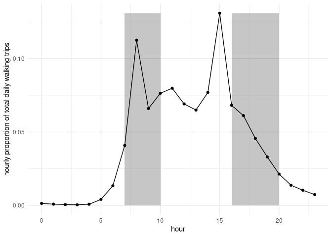
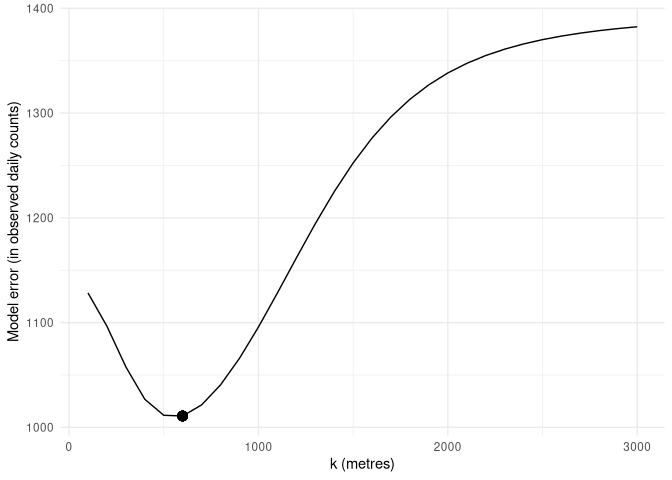
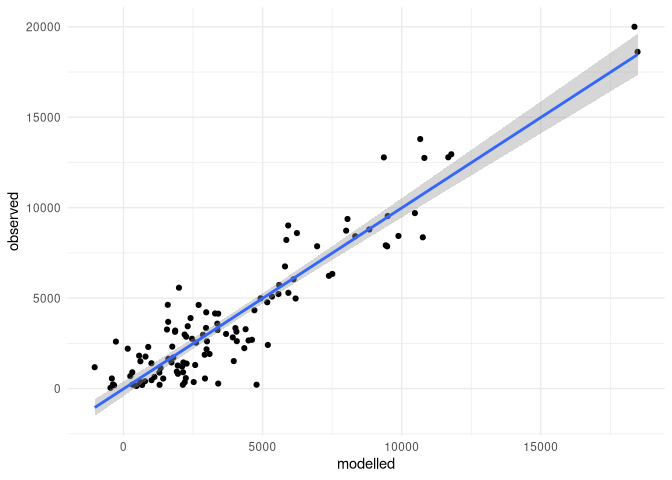

<!-- README.md is generated from README.Rmd. Please edit that file -->

# Introduction

Calibration of UPTHAT (the Urban Planning and Transport Health
Assessment Toolkit) relies primarily on new high performace software
(Padgham and Peutschnig 2019) for analysing dynamic movement through
urban areas.

This manuscript details procedures developed for calibrating UPTHAT
estimates of both pedestrian and cyclist densities along individual
street segments against empirical data from New York City, USA.

# Methods

## Data Sources

UPTHAT is based out of principle on entirely open data sets, primarily
on data from Open Street Map and “worldpop” (www.worldpop.org). The
latter data enable estimates of population flows to be made in absolute
terms, given aggregate data on proportions and typical frequencies of
trips.

Data on pedestrian densities was obtained from New York City Government
[pedestrian count
data](https://www1.nyc.gov/html/dot/html/about/datafeeds.shtml#Pedestrians),
collected bi-annually at 114 stations throughout the city, encompassing
a total area of 705 km2. Additional data on subway usage was
obtained from the city’s [Metropolitan Transit Authority
(MTA)](http://web.mta.info/nyct/facts/ridership/ridership_sub_annual.htm),
with data on locations obtained through the city’s [open data
portal](https://data.cityofnewyork.us/Transportation/Subway-Stations/arq3-7z49).
The MTA figures are annual “ridership totals” for each station, which
are counts of number of passengers entering the system at each of 424
stations (or, in a few cases, “station complexes”, at which a single
entrance provides access to multiple proximate stations and multiple
lines). There are no data for system exits, and so we assumed that exit
numbers equalled entrance numbers throughout. The station locations
given by the City of New York are single coordinates for each station
(473 in total). The City also provides coordinates of all subway
*entrances* (1,926 in total), along with associated subway lines to
which those entrances lead, with entrances often providing access to
multiple subway lines. We allocated the ridership data to subway
entrances by associating each entrance for a given line with the station
coordinates for that line, and associating each subway entrance with the
nearest station for that line. Entrances were associated with individual
stations by repeating this procedure for all subway lines, resulting in
many entrances being associated with both different subway lines and
different stations, but nevertheless providing an accurate connection
between subway entrances, the stations to which they lead, and the MTA’s
ridership counts. Counts for each station were then distributed equally
among all associated subway entrances, ultimately converting 424 counts
into 1,926 locations of associated pedestrian flows.

### The Street Network

Both the street network used to route pedestrian journeys, and the
structure, nature, and location of buildings serving as origins and/or
destinations of those journeys were obtained from Open Street Map,
accessed via the R package, `osmdata`
(**???**).
The network consisted of 813,402 street segments, representing a total
30,226 km. These segments are simply those used to represent Open Street
Map, such that a single linear length of way may be represented by
several points, and several corresponding edges in our internal
representation. We then used the `dodgr` software (Padgham and
Peutschnig 2019) to “contract” this network down to segments between
junctions points only, reducing it to 407,840 segments.

Each of these 407,840 segments had an associated length, along with
further detail as contained in the Open Street Map data, including the
type of way (with such values as “cycleway”, “footway”, “pedestrian”, or
“steps”). These types were used to weight the distances to reflect
typical pedestrian preferences (Luxen and Vetter 2011), to enable
pedestrian routes to be accurately calculated. These weighting schemes
act to extend the effective length of ways unsuitable for pedestrians,
for example, by multiplying actual lengths of major vehicular roads by
some factor representative of the associated pedestrian discomfort in
comparison to quiet, pedestrian-only ways. All weighting factors are
greater than one, so that the most pedestrian-friendly ways retain their
original distances, while ways less suitable for pedestrian travel have
weighted lengths greater than their actual lengths. Routing is then
conducted using these weighted lengths, and so routes reflect those that
would be typically chosen by pedestrians. Rather than distance-based
routing, we used time-based routing, which operates on a similar
principle, but introduces several categories of additional time-based
penalties, notably for waiting at traffic lights, or for waiting to
cross busy, multi-lane roads (where such crossing is permitted). All
routing was implemented using the authors’ own `dodgr` software (Padgham
and Peutschnig 2019).

### Trip categories

Open Street Map includes not only streets, but also buildings with
optional yet frequently extensive descriptions of categories, purpose,
sizes, and other properties. These building descriptions enable Open
Street Map to be used to identify likely locations of trip origins and
destinations according to trip purpose. In particular, we divided
building categories into the five main groups of transportation,
sustenance, entertainment, education, and healthcare, each by grouping
the Open Street Map tags given in Appendix 1. Transportation notably
included all parking facilities, both for bicycles and automobiles.

For each of these categories, we estimated local intensities of the
respective activities by attributing all buildings to the nearest street
network junction, and aggregating numbers at each junction. These
numbers provided estimates of likely numbers of people originating from
or coming to that point for the respective activities, and are referred
to throughout the present work as “densities.” For transportation, Open
Street Map data commonly include capacities of parking facilities,
whether for bicycles or automobiles. These capacities were taken as the
densities of points which provided them, while all other points were
assigned the average capacity of all functionally similar points (so,
for example, bicycle parking facilities absent specified capacity were
assigned the average capacity of all bicycle parking facilities with
specified capacities).

Beyond these Open Street Map-based estimates, we also used Worldpop data
to ascribe aggregate residential densities to each street junction, and
subway counts to represent journeys to or from entrances and exits of
the New York MTA subway system. A final category was based on the
betweenness centrality of the entire street network. Centrality is known
to be a strong determinant of travel behaviour, with more central
points, or street segments, correlated with higher densities of
movements towards or away from those points or segments. A final
categorical trip purpose considered in our analyses below is thus,
“centrality”.

Extraction and processing of these data enabled analyses of the
following eight trip categories, serving as types of journey origins or
destinations:

| n | category       |
| - | -------------- |
| 1 | subway         |
| 2 | centrality     |
| 3 | residential    |
| 4 | transportation |
| 5 | sustenance     |
| 6 | entertainment  |
| 7 | education      |
| 8 | healthcare     |

Each category of trip represented one pairwise combination of these
eight categories, yielding 8×7 = 56 distinct categories. An additional
eight categories were formed through modelling random dispersal away
from spatial locations identified for each category.

## Modelling Pedestrian Flows

We modelled pedestrian flows throughout the entirety of New York City,
USA, in order to calibrate our models against the empirical data from
the 114 pedestrian count stations. Models were constructed using the
[`dodgr`](https://github.com/atfutures/dodgr) software package for
large-scale routing through street networks, by assembling an array of
“flow layers” representing pedestrian flows between the distinct
categories of origin and destination points described above.

Flow layers were generated in two primary ways: either by dispersing
from a given set of origin points according to specified densities, or
through routing flows between specific sets of origin and destination
points, with densities calculated by a doubly-constrained spatial
interaction model, with exponential form used throughout
(**???**).
We refer to these two methods of calculating flow layers as “flow
dispersal” and “flow aggregation”, and illustrate both in the following
sub-sections.

### Flow Layers

Our models comprised a variety of flow layers, each of which was
generated by applying the spatial interaction models described above
between a specified set of origin points, taken from the eight
categories given above. Each flow layer was obtained through calculating
shortest paths between each origin point, \(i\), and destination point,
\(j\), in the network, and aggregating flows according to exponential
spatial interaction models
(**???**)
of the form,  where \(d_{ij}\) denotes the distance between the points
\(i\) and \(j\) (and self-flows \(SI_{ii}\) were excluded), and \(n_i\)
denotes the number or densities of individuals at origin point \(i\).
The denominator ensured that our models were singly-constrained to unit
sums for each origin, \(i\), over densities at destinations, \(j\). The
above form gives the expected flow, in direct units of \(n_i\), along
the path between the points \(i\) and \(j\). Layers were also calculated
describing undirected dispersal throughout the entire network from a set
of origin points.

Our [`dodgr`](https://github.com/ATFutures/dodgr) software enables
spatial interaction models to be efficiently calculated for a range of
exponential decay coefficients, `k`, returning a matrix of flows, with
one row for each segment of the network, and one column for each
exponential decay coefficient entered. This enabled us to initially
calculate all flow layers for defined values of `k`, and to subsequently
combine these pre-calculated layers in a single model as described in
the following section. Each layer was calculated for 30 values of `k`,
from 100 to 3000 metres in 100 metre increments.

The strength of spatial interaction (SI) given above was used to
determine the flow between each pair of origins and destinations in a
given layer. The flow along the path between any given pair was then
equal to the SI value divided by the length of the path. Such division
has the important effect of ensuring that the sum of flows throughout
the entire network is equal to the sum of densities at all origins for
that layer, \(\sum_i n_i\). This procedure is also equivalent to
presuming that the SI specifies a static property such as aggregate
flows per unit time, whereas the flow layer itself provides a dynamic or
probabilistic snapshot such that, for a flow of \(F\) between two
points, \(i\) and \(j\), separated by \(n\) edges, the flow along any
one of those edges at any instant of time will equal \(F/n\) (Figure 1).

Finally, the city-wide flows from these flow layers, amounting in each
layer to values along over 800,000 street segments, were mapped on to
the locations of the pedestrian count stations. Flow layers contained
non-zero values for the actual street segments on which count stations
were located only where the data describing the start and end points
translated into at least one route passing along that segment. This was
not always the case, and so values for each pedestrian counter were
aggregated from a selected number of nearest non-zero flow values. This
number itself was varied between 1 and 20, and the value chosen which
gave the minimal error model following the procedures in the subsequent
section. This approach yielded flow values at pedestrian count stations
which were aggregated over potentially differing numbers of nearest
street segments for the different layers, but we argue that this
procedure is appropriate because actual placements of flow values for
each layer depend on the spatial location and variability of data as
recorded in Open Street Map.

### Statistical Models

The 64 pairwise combinations of origin and destination categories
represents 64 potential independent variables in a statistical model.
Our final model incorporated only a small fraction of this total number,
through applying a step-wise variable addition procedure. The first
layer was selected by applying the same procedure to each layer of
aggregated flows generated by each of the 30 value of `k`, across
numbers of nearest segments, `n`, from 1 to 20 as described above, to
determine the values of `k` and `n` that minimised the error of a
standard linear regression against observed pedestrian counts. The layer
which yielded the overall minimal error was selected as the first model
layer.

The procedure was then repeated by applying an analogous procedure to
all 63 remaining layers, and including the flow values from the
previously-selected layer in a multiple linear regression model. Having
selected the second layer, it was then also included along with each of
the remaining 62 layers, in order to determine the third layer yielding
the model with the lowest overall error. Flow layers were successively
added to the model as long as their contribution to the model was
significant; that is, layer addition within the model was terminated as
soon as the next layer added made no significant contribution. Where the
addition of new layers rendered the contribution of any prior layers no
longer significant, those non-significant layers were removed from the
model. We used two degrees of significance to generate the results given
below: initial model construction used a significance of \(p\le0.05\),
while final models only retained layers with \(p\le0.01\). Removal of
layers modifies resultant models, including significance values, and so
removal of layers with \(0.01<p\le0.05\) was iterated until all
remaining layers in the final model had \(p\le0.01\).

Finally, it is statistically possible for flow layers to be
significantly *negatively* correlated with observed counts (Figure 2).
Because each layer was formed from effectively arbitrary categories, and
because there was no way of knowing at the outset which categories may
or may not be significantly related to pedestrian behaviour, negative
correlations must be expected. In the context of Fig. 2, a negative
correlation could only be avoided if the layers L1 and L2 were combined
at the outset to generate a single composite layer. In general, there
can be no way of knowing in advance which combinations of layers might
be necessary to avoid negative correlations.

## Calibration to Observed Values

The observed pedestrian counts are given as total numbers observed
within either two- or three-hour windows (twice on weekdays, between
7-9am and 4-7pm; and once on Saturdays, between 12-2pm). We used the
weekday counts to yield an overall aggregate estimate of numbers per
day. To scale the observed values, we compared them with values derived
from the United Kingdom’s National Travel Survey
([NTS](https://beta.ukdataservice.ac.uk/datacatalogue/series/series?id=2000037),
waves 2002-2017 representing 5.8m single stage journeys), from which we
obtained a nation-wide estimate of numbers of walking trips for each of
the 24 hours of the day (see Figure 3).

These data reflected a total proportion of trips between the hours of
7-9am and 4-7pm of 42.7%. We assumed this figure to approximately
reflect global pedestrian behaviour, and so converted observed
pedestrian counts – as the sum of the morning plus afternoon values – to
expected equivalent daily totals for weekdays by multiplying by 1 / 0.43
= 2.34.

One of our motivating aims was to derive a model that could accurately
predict absolute pedestrian counts. Our final models were regression
models, and so the resultant estimates for each layer provided relative
scaling coefficients for those layers. Flow values for the layers
themselves were determined by values at the points of origin for each
layer, such that the sum of flows for each layer was equal to the sum of
values for all origins in that layer (see Figure 1). For example, the
sum across the entire network of flows dispersing away from all subway
exits was equal to the total number of passengers entering and,
according to our assumption, exiting all stations of the subway system.
Note, however, that even this layer may result in a model estimate
greater than one, because the contribution to observed pedestrian counts
of numbers *effectively* dispersing from subway exits may in fact exceed
the actual numbers exiting, because this layer may in fact capture more
pedestrian activity than just dispersive movement of actual subway
passengers. A resultant model estimate for the layer representing
dispersal away from subway exits would nevertheless provide a direct
quantification of any such effect, and be able to be directly translated
into absolute terms. The number of pedestrians according to such a
resultant model effectively dispersing from subway exits would equal
actual numbers measured in the subway times the resultant model
coefficient.

Other layers result in more abstract scaling, but scales that are
nevertheless straightforward to interpret. Four of the categories are
directly associated with the location and form of built structures:
sustenance, entertainment, education, and healthcare. In each case,
sizes of origins were aggregate numbers of building of these categories
associated with each junction of the street network. The reason these
categories were treated independently was because each is generally
associated with different scales – healthcare includes hospitals, which
can be very large, and serve as origins and destinations for large
numbers of pedestrian journeys. Educational institutions can be
similarly large, but potentially cater for distinctly different social
groups. The category of sustenance includes restaurants and supermarkets
(and any categories in between), and so may vary markedly in effective
size. Entertainment may be similarly diverse, and was included as its
own separate category primarily because pedestrian movement to and from
entertainment centres is likely to occur at markedly different times of
day (or night, as the case may be) than movement in relation to the
other categories and, even if only through this difference alone, may
manifest categorically distinct patterns of movement.

Transportation was considered its own distinct category according to an
hypothesis that movement to or from transportation centres may capture
pedestrian behaviour in relation to both cycling and the driving of
automobiles. As described above, sizes of transportation sources were
quantified in numbers of parking places where given, with local averages
assigned to locations lacking specific capacities. Finally, centrality
has its own absolute scale equal to the square of the total number of
distinct vertices or points within a network. In our case, this was
equal to the total number of street junctions, which was 134,732.
Centrality was simply rescaled to a maximum of one, and was the only
category to which an absolute scale could not be assigned.

For all other categories, the results below give effective numbers of
pedestrians observed in the final model for each unit of the
corresponding type of origin; for example, \(n\) pedestrians per
restaurant or supermarket for the sustenance category, or \(n\)
pedestrians per unit of parking capacity for transportation. These scale
of layers to absolute numbers of pedestrians form a central part of the
results that follow.

# Results

The flow layer which made the most significant initial contribution
reflected movement from subway stations towards network centrality. The
model error as a function of the 30 values of exponential decay
coefficients is illustrated in Figure 4, and was typical for most
layers, manifesting a clear and distinctive minimum at 600m.

Following the procedure described above of adding the next minimal error
layer that was significant, while removing any layers rendered
non-significant through the addition of subsequent layers, resulted in
the final model statistically summarised in Table 1, ordered in
decreasing values of T-statistics.

Layer Name | Estimate | Std. Error | t value | Pr(>|t|)
--------- | ------- | --------- | ------ | --------
hea-dis    |   105658 |      10706 |    9.87 |    0.0000
sub-dis    |       23 |          3 |    8.99 |    0.0000
sub-cen    |     -10 |          1 |  -6.99 |    0.0000
sub-hea    |        8 |          1 |    6.66 |    0.0000
sus-edu    |   -5924 |        978 |  -6.06 |    0.0000
edu-hea    |  -24921 |       4445 |  -5.61 |    0.0000
edu-tra    |    23977 |       4484 |    5.35 |    0.0000
sub-tra    |        6 |          1 |    5.08 |    0.0000
sus-res    |     6258 |       1232 |    5.08 |    0.0000
sus-sub    |   -1337 |        331 |  -4.04 |    0.0001
sus-ent    |     1446 |        361 |    4.00 |    0.0001
edu-dis    |  -78057 |      24521 |  -3.18 |    0.0020
ent-tra    |    38179 |      12019 |    3.18 |    0.0020
edu-sus    |    16904 |       5572 |    3.03 |    0.0031

Table 1. Statistical parameters of final model of pedestrian flows
through New York City. (Placeholder only in rendered version)

That model was able to explain R2 = 0.859 of the observed
variation in pedestrian counts across New York City. Converting the
estimates of the resultant statistical model into absolute scales of
pedestrians per day and summing the result yielded the model shown in
Figure 5.

# Discussion

The model developed here was able to reproduce over 85% of the observed
variation in pedestrian counts at 114 stations encompassing a large
portion of New York City.

# References

Luxen, Dennis, and Christian Vetter. 2011. “Real-Time Routing with
OpenStreetMap Data.” In *Proceedings of the 19th ACM SIGSPATIAL
International Conference on Advances in Geographic Information Systems*,
513–16. GIS ’11. New York, NY, USA: ACM.
<https://doi.org/10.1145/2093973.2094062>.

Padgham, Mark, and Andreas Peutschnig. 2019. *Dodgr: An R Package for
Network Flow Aggregation*. Vol. 2. Transport Findings. Network Design
Lab. <https://doi.org/10.32866/6945>.

