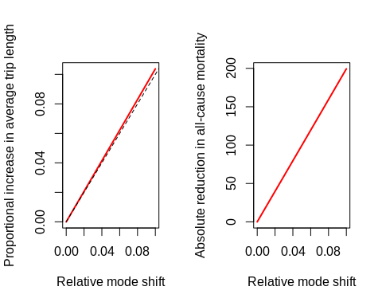
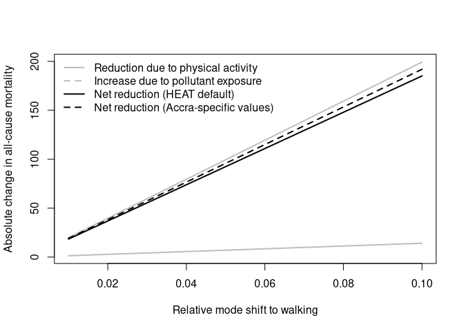

This document describes the general principles of UPTHAT, with specific
instructions on how to adapt the analyses to new locations. The basis of
UPTHAT is detailed pedestrian flow model, able to be generated as
described in the following section. (This will soon be extended to
include models of bicycle flow, with their own accompanying adaptation
section.) The second of the following sections describes how to generate
scenarios of mobility change for new cities, and the third describes the
steps necessary to translate such scenarios into quantitative effect
effects, largely building on the methodology of the WHO’s Health and
Economic Assessment Tool (HEAT).

Almost all data inputs for UPTHAT can be derived from Open Street Map
(OSM) data. Not all locations are represented equally within OSM, and it
may be that a particular location is not sufficiently well represented
for an UPTHAT model to be accurately derived. The primary step that
would need to be taken to address any such data inadequacy would be to
enhance the city’s representation in OSM, a step that would enhance any
and all other present and future analyses through enriching data on
urban structure within what is arguably the world’s foremost publicly
open and accessible database on urban form and structure.

Data within OSM are primarily structured in terms of so-called
“key-value pairs.” A given entity is entered into the database as a
series of one or more coordinates (that is, longitude and latitude
values), and described with an arbitrary number of key-value pairs. Each
key defines what is being described, and each value provides the actual
description. While anybody is free to enter anything they desire into
OSM, a set of well-documented guidelines define standard or best
practices for entering various urban structures. Streets, paths, roads,
and the like are, for example, all primarily defined with the key of
“highway”, with associated values also generally defined by a
relatively small set of possible values.

# Modelling pedestrian flow

Our models of pedestrian flow extend from our initial calibration
against empirical pedestrian counts in New York City, which revealed the
primary generator of pedestrian trips to be public transport stops and
stations (Zacharias 2001)–most pedestrian trips involve people walking
to and from public transport. One of the primary initial requirements of
UPTHAT accordingly requires estimates of public transport usage, as
described in the following sub-section. Following that, we briefly
describe the stages which might be necessary to obtain an accurate
representation of the street network from OSM, before concluding this
section with a description of building structures and functions used in
UPTHAT.

## Public Transportation

We presume for this section that a city has a bus system serving public
transportation needs (regardless of whether the buses themselves are
public or private), and that all (or at least most) bus lines and bus
stops are accurately represented in OSM. Train and tram lines can also
be directly incorporated, but are not yet described here in this initial
incorporation of our adaptation manual, because UPTHAT has not yet been
adapted to any cities which have these modes of public transport.

UPTHAT needs data both on entire bus routes, and on bus stops. OSM
actually has three primary kinds of data, representing single points,
extended lines, and complex higher-order relationships. Bus stops are
almost always defined as simple points, often associated with a key
alone regardless of value. There are two common ways within OSM of
representing both bus stops and bus lines:

| Representation | stop key            | stop value | route key | route value |
| -------------- | ------------------- | ---------- | --------- | ----------- |
| 1\.            | “bus”               | “platform” | “type”    | “route”     |
| 2\.            | “public\_transport” | .          | “route”   | “bus”       |

Values defining stops for the second form are arbitrary, but are
generally specified as simple values of “yes”.

Having established which form of representation a city has implemented,
public transport usage is estimated by extracting the OSM representation
of the bus network, and analysing the “centrality” of that network. This
provides a measure of how “central” each bus stop is within the entire
urban network. This metric is known to provide a reasonable proxy for
public transport usage (Derrible 2012; Jiang, Lu, and Peng 2018).

A city may have its own estimates of, for example, bus stop usage, which
may provide more accurate estimates that our default approach of network
analysis. We have ensured that such data can be readily incorporated,
but have not yet automated this step.

## The street and way network

The next step is to extract the street and way network of a city. Street
and way networks within OSM are nearly complete for most of the world
(Barrington-Leigh and Millard-Ball 2017), and this stage is generally
very largely automatic. There may nevertheless be local particularities
that necessitate manual processing. Open Street Map is often *very* up
to date, and includes numerous options for representing projects under
construction, or in the process of being demolished. Such temporary
modifications to a city’s street network may have a noticeable effect of
the output of UPTHAT, and require the network to be inspected and
potentially manually modified. For example, large projects under
construction may generally need to be incorporated within the model in
their anticipated state of completion. This generally just requires
identifying any such projects, and changing key-value pairs from, for
example, key = “highway”, value = “construction”, to key = “highway”,
value = “motorway”, or whatever appropriate value the project may
represent on completion.

One additional note on UPTHAT and the OSM network concerns pedestrian
networks. These may be less well represented in some cities that the
street network intended for motorized transport. Such cities may require
additional enhancement of the OSM representation of the pedestrianized
aspects of their way network, with such needs best address by modifying
and contributing to OSM itself, as described at the outset. We
nevertheless note that all cities in which the tool has been deployed
have had very good representation of pedestrian aspects of their
networks.

## Buildings

UPTHAT works by generating layers of pedestrian “flows” representing
movement for different categories of activities. These categories are in
turn represented in OSM by descriptions of buildings—for example, one
category is “health”, for which movement is directed to or from all
buildings with key = “building” and value = “hospital” (along with
several additional ways to represent healthcare facilities in OSM). The
more detailed the building structure of a city within OSM is, the more
detailed will be the resultant UPTHAT model. While streets may be
presumed to be universally well represented within OSM, buildings may
not, and many cities only have rudimentary representations of their
building structures. We have developed an alternative approach for such
cities, drawing on publicly accessible data from google, by simply
extracting all so-called “places of interest”. Layers are then
constructed of movement to, from, and between all such points regardless
of actual purpose.

If the building structure of a city is sufficiently well represented,
then the stage of building extraction and processing can be fully
automated. We are in the process of developing a step to automatically
quantify how well a city’s building structures are represented within
OSM, so that the entire processing of buildings within UPTHAT can be
automated. Nevertheless, until this stage is complete, cities need to
minimally perform the single step of approximately ascertaining how well
their building structure is actually represented.

## Local Pedestrian Count Data

Once the above three types of data have been extracted and
pre-processed, the models of pedestrian movement between the various
categories of origins and destinations can be automatically calculated.
These models should ideally be calibrated to local circumstances, and in
particularly to any data that may be able to be provided by a city. The
following represent the three main possibilities of local data
provision:

1.  **No Data Able to be Provided** Cities which can provide no local
    data whatsoever can nevertheless receive a model of *relative*
    pedestrian flows throughout their cities. Such models will have an
    absolute scale provided through calibration with data from other
    locations, and so not necessarily appropriate to that particular
    city. In these cases, a city should presume both that numbers should
    be considered accurate only within some unknown multiplicative
    constant (such that real flows may be some \(N\) times depicted
    flows, for some unknown value of \(N\)), and that spatial
    distributions will only approximate actual flows. Such models may
    nevertheless provide highly useful information, through providing a
    highly spatially detailed estimate of where people actually walk
    within a city.
2.  **City Provides A Single Estimate of Actual Pedestrian Counts** More
    accurate results can be obtained where cities are to provide a
    single estimate of pedestrian counts. This can be either observed
    counts at a single location, or some city-wide estimate of, say,
    average numbers of daily pedestrian trips per person per day. This
    information is sufficient to ensure that the scales of pedestrian
    flows depicted in UPTHAT reflect actual pedestrian behaviour within
    a given city. The relative spatial distribution ought nevertheless
    be presumed to only approximately represent the actual distribution.
3.  **City Provides Multiple Pedestrian Counts** Relative spatial
    distributions of pedestrian flows in UPTHAT can only be accurately
    estimated from multiple pedestrian counts within any city. This is
    because the models are formed by combining multiple layers, with the
    relative contribution of each layer only able to be estimated by
    comparing predictions within multiple observed pedestrian counts.
    Two pedestrian counts in a city will enable accurate combination of
    two flow layers; three counts will enable three layers to be
    combined, and so on. Our primary calibration procedure was developed
    for New York City, which has 114 count stations, and which enabled
    the accurate combination of up to 64 distinct layers. In short: the
    more empirical counts that a city has, the more accurate will be the
    resultant UPTHAT model.

# Pedestrian Exposure to Vehicular Emissions

The next stage in UPTHAT is to convert the model of pedestrian flows to
a model of exposure to vehicular emissions. This requires a model of
vehicular flow throughout a city. Unlike pedestrian flows, which are
notoriously unpredictable, vehicular flows are generally much more
predictable, and are generally well modelled by analysing the
“centrality” of the vehicular network, similar to the approach
described above for public transport. We model vehicular flows using
time-based routing, which presumes drivers follow fastest, yet not
necessarily shortest, routes between origins and destinations. Our
models include all possible confounding factors such as differences in
speed limits on different kinds of roads, and time penalties for waiting
at traffic lights, and for turning across oncoming traffic. This stage
can be entirely automated, and cities will generally not need to
manually intervene at any stage in the generation of vehicular flow
estimates, unless a city believes that it already has a model more
accurate than our own models, in which case immediate substitution of
one model for another is also very straightforward.

Having generated or otherwise obtained a model of vehicular flows, we
then presume vehicular emissions to disperse away from the source
according to a standard Gaussian dispersal process. UPTHAT requires
specification of single value describing the width of such dispersal,
for which we currently use a default value of 200 metres. The resultant
layer of dispersed vehicular flows then provides an estimate of the
*relative* intensity of vehicular emissions throughout a city. The
exposure of pedestrians to these vehicular emissions can then be derived
by multiplying pedestrian flow intensities by these dispersed vehicular
emissions. We currently do this by multiplying absolute pedestrian
counts (in numbers per day) by vehicular emissions scaled to relative
intensities between zero and one. The result then provides an estimate
for each street segment of the relative exposure of pedestrians to the
effects of vehicular emissions.

The effects of such exposure on health are then evaluated by reference
to our scenario calculations, through using before-and-after
calculations of a given scenario as inputs to HEAT. For this prototype
exercise, we have used values provided by the WHO for Accra, Ghana.

## General parameters

We adopt the following general parameters directly from HEAT
methodology. The relative reduction in risk for walking is assumed to be
0.886, such that the effect for walking a certain distance under a given
scenario of

``` }
0.114 * d-scenario / d-reference
```

where `d_reference` and `d_scenario` are respective distances walked
under the reference and scenario conditions. Risk reduction for walking
is capped at 30%, but does not approach that value in any of our models.

Each increment of exposure of +10 ug/m^3 (considered to refer to PM2.5
throughout, as in HEAT, with effects of other pollutants such as PM10
assumed to be linearly related to effects of PM2.5) is assumed to
increase all-cause mortality risk by 1.07. Effects of increased exposure
are presumed to cease above 50ug/m^3. In contrast to HEAT, which assumes
the increase in exposure for walking to be a constant factor of 1.6, we
use values derived from literature specific to Accra, with spatial
interpolation provided by our models as described below.

In the absence of a specific general mortality rate for Accra, we simply
averaged values for all countries from the [WHO mortality
database](http://apps.who.int/healthinfo/statistics/mortality/whodpms).
The figures are included here, yielding a global average mortality rate
as follows:

``` r
x <- read.csv ("./who-mortality.csv")
names (x) <- c ("country", "population", "deaths", "remove")
x$remove <- NULL
x <- x [!is.na (x$deaths), ]
mortality <- mean (x$deaths / x$population)
message ("global mortality = ", mortality)
#> global mortality = 0.00742570824543746
```

The respective populations of Accra and Kathmandu are presumed to be is
2.27 and 1.74 million, as taken from from wikipedia.

## Accra-specific data

### Air Pollution

An article on [air pollution in sub-Saharan African
cities](https://link.springer.com/article/10.1007%2Fs11869-013-0199-6)
has an appendix
[here](https://static-content.springer.com/esm/art%3A10.1007%2Fs11869-013-0199-6/MediaObjects/11869_2013_199_MOESM1_ESM.docx)
that includes figures for Accra from [this
paper](https://pubs.acs.org/doi/10.1021/es903276s). That estimates
average PM2.5 concentrations throughout the year *apart from* Dec-Jan,
when dust blows in from the Sahara, of 39-53ug/m^3 at roadside sites,
and 30-70ug/m^3 at residential sites. Across the whole year, average
values at roadside sites were 80-108ug/m^3, and at residential sites
57-106ug/m^3.

The paper helpfully simply states that PM2.5 concentrations at roadside
sites were 8-14ug/m^3 higher at roadside than at residential sites. This
suggests we can assume a background value of 35ug/m^3, with road-borne
emissions adding another 14ug/m^3 at the highest vehicular intensities.
The following analyses assume these values, and allocate the additional
14ug/m^3 assumed to be caused by vehicular pollution according to a
standard model of automobile traffic throughout the city. Vehicular
emissions are presumed to disperse away from direct linear (road-based)
sources via a Gaussian dispersal model with an assumed half-width of 200
metres. The following results are largely invariant to precise choice of
this dispersal width.

### Walking statistics

We derived estimates of average daily walking distance from data
previously shared by WHO, as follows. Average distances walked to the
nearest market (in kilometres) were given as in the following table,
which translates to an average distance of 2.77 km:

| \<1  | 1.1-2 | 2.1-3 | 3.1-6 | 6.1-10 |
| ---- | ----- | ----- | ----- | ------ |
| 27.3 | 21.2  | 6.1   | 42.4  | 3.0    |

Distances walked from home to the nearest bus (trotro) stop were
similarly tabulated as follows, translating to an average distance to
trotro of 0.51 km:

| 0-0.5 | 0.6-1 | 1.1-2 | 2.1-5 | \> 5 |
| ----- | ----- | ----- | ----- | ---- |
| 83.2  | 11.9  | 2.3   | 0.5   | 2.2  |

We then estimated average distances walked to work from statistics for
mode of transport taken to work of 47.4% walking and 19% trotro. Walks
to work were assumed to reflect distances typical of the above walks to
the nearest market, giving a resultant mean distance to work of `d_work
= (0.474 * d_work + 0.19 * d_trotro) / (0.474 + 0.19) = 2.12 km`

Numbers of trips per day was also tabulated as follows, translating to
an average of 11.2 walking trips per day.

| 0-10 | 11-20 | 21-30 | 31-40 | 41-60 | 61-100 | \> 100 |
| ---- | ----- | ----- | ----- | ----- | ------ | ------ |
| 64.0 | 20.4  | 6.2   | 2.9   | 3.4   | 0.7    | 0.0    |

This number of trips per day was converted to a weekly estimate of 78.8
trips. Of these trips, an average of 2.5 per person per week were
presumed to be trips to work, and an equivalent number trips to the
nearest markets (or other trips over equivalent distances). The
distances of one half of the remaining 73.8 trips were presumed to be
typified by distances to trotro, and so have mean values of 0.51 km, the
remaining half to be double that distance. This yielded an estimated
average weekly distance walked of 66.3 km, or a daily value of 9.48 km.
This figure may seem unusually high, especially compared with the
baseline value assumed in HEAT of 14.84 km *per week*, but it must also
be noted that 93% of all Accra residents walk to purchase food or other
necessities.

## Scenarios

The above figures can be translated into effective increase in distance
walked per week in response to a relative modal increases in walking.
These increased can then also be translated according to the standard
HEAT values along with the global average mortality rate, into an
estimate of reduction in mortality in Accra. The resultant figures are
shown in the following graph.


Increased walking also increases exposure to pollutants, as also
quantified in HEAT in terms of excess mortality arising through
increased in active transport. The following figure represents both the
standard HEAT assumptions of an increase in exposure (to PM2.5) of 1.6
for walking, and the specific figure for Accra derived from the above
literature of 1.31 (because background pollution in Accra is so high to
begin with).



These idealised scenarios can then be given specific context through
applying our procedures described in our separate “Scenarios” document
to a particular city, in order to generate locally realistic scenarios
of response to such measures as the addition of bus stops, or the
restriction of motorized vehicles in the inner city. The outputs of our
scenario calculations will then provide absolute values for expected
increases in numbers and/or lengths of walking trips, along with
associated decreases in numbers and/or lengths of trips made in private
motorized vehicles.

## Spatial Scenarios

We adapted the procedure used to generate the above figures to provide
spatially explicit estimates of relative reduction in all-cause
mortality, and the net increase in all-cause mortality due to increased
exposure. To do so, we modelled vehicular flows through the city by
presuming them to be proportional to the betweenness centrality of the
street network as weighted for vehicular routing, using a time-based
rather than distance-based routing algorithm. Pedestrian flows were
simulated as described in the accompanying manuscript presenting our
model of pedestrian flows throughout New York City.

A given scenario of modal change was associated with a specific change
in average daily walking distance. We used the standard HEAT-assumed
average walking speed of 5.3 kilometres per hour to convert these values
into total daily durations of exposure to additional vehicular-borne
pollutants. This enabled an estimate of total daily exposure, through
presuming the remainder of the day to be spent exposed to the background
rate of 35ug/m^3.

As described above, vehicular-borne emissions were presumed to disperse
away form the source according to a Gaussian dispersal kernel with a
half-width of 200 metres. A flow of \(f\) people along a particular
street segment was then modified under a given scenario with a modal
increase in walking of \(a\), to \(f (1 + a)\), and an associated
increase in exposure proportional to the intensity of diffused
pollutants along that segment in relation to the background value. We
also incorporated our estimates of modal *decrease* in vehicular usage,
through assuming this to translate into a proportional decrease in
overall vehicular-borne emissions, and thus a concomitant decrease in
expected lives lost through increased exposure.

This procedure yielded the exposure layers presented in our Upthat tool,
with values along each street segment scaled such that the maximum value
corresponds to the expected *static* value according as presented in the
above figure. It is also noteworthy that the extremely high background
levels of PM2.5 concentration in Accra mean that expected increases in
mortality owing to increases in exposure are actually very slight,
generally less than one additional death per year (further reduced by
the presumed decrease in vehicular emissions according to our models of
modal shift). The spatially explicit analyses are nevertheless uniquely
powerful tools for highlight the areas of the city in which exposure of
pedestrians to vehicular-borne emissions imposes the greatest health
burden.

In contrast to the low values of expected additional mortality, the
health benefits of active transport translate to tens to hundreds of
lives saved, depending on overall modal shift. In a spatially explicit
context, these benefits are in direct proportion to expected pedestrian
flows, and so are not explicitly shown in our Upthat tool. The tool
simply shows expected pedestrian flows, with translation to expected
lives saved depicted as part of our scenario analyses.

# References

<div id="refs" class="references">

<div id="ref-barrington-leigh_worlds_2017">

Barrington-Leigh, Christopher, and Adam Millard-Ball. 2017. “The World’s
User-Generated Road Map Is More Than 80% Complete.” *PLOS ONE* 12 (8):
e0180698. <https://doi.org/10.1371/journal.pone.0180698>.

</div>

<div id="ref-derrible_network_2012">

Derrible, Sybil. 2012. “Network Centrality of Metro Systems.” *PLOS ONE*
7 (7): e40575. <https://doi.org/10.1371/journal.pone.0040575>.

</div>

<div id="ref-jiang_station-based_2018">

Jiang, Ruoyun, Qing-Chang Lu, and Zhong-Ren Peng. 2018. “A Station-Based
Rail Transit Network Vulnerability Measure Considering Land Use
Dependency.” *Journal of Transport Geography* 66 (January): 10–18.
<https://doi.org/10.1016/j.jtrangeo.2017.09.009>.

</div>

<div id="ref-zacharias_pedestrian_2001">

Zacharias, John. 2001. “Pedestrian Behavior Pedestrian Behavior and
Perception in Urban Walking Environments.” *Journal of Planning
Literature* 16 (1): 3–18. <https://doi.org/10.1177/08854120122093249>.

</div>

</div>
