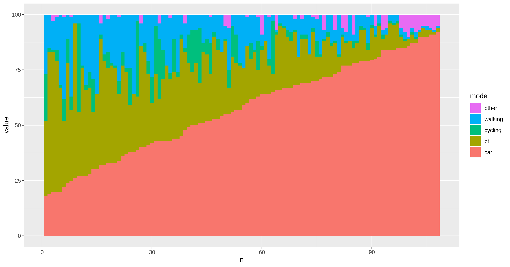
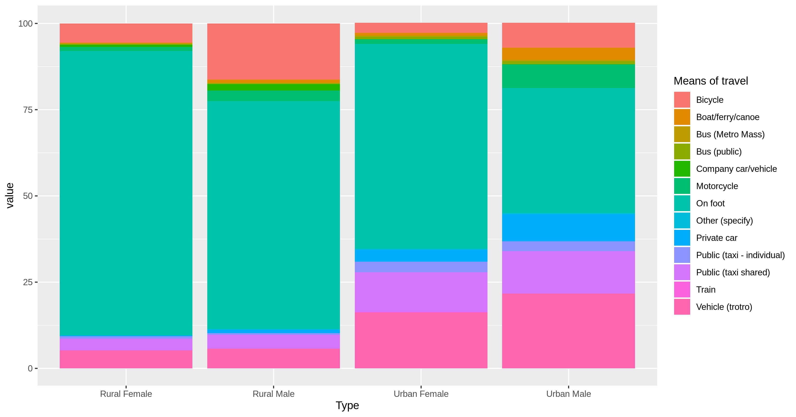
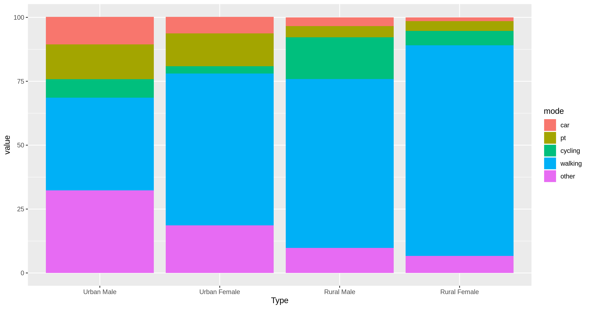

Scenarios for the urban planning and transport health assessment tool
================

# Introduction

This report documents deliverable 2, scenario developement, for the WHO
UPTHAT project, which involves: (1) setting out high level policy
scenarios of active transport uptake; (2) converting these changes into
estimates of rates of shift towards walking and cycling down to route
network levels; and (3) simulating the impacts of these scenarios on
walking and cycling levels citywide. Scenario development will also be
strongly informed by the transport scenarios assessed in Accra and
Kathmandu as part of UHI project activities.

# High level policy scenarios of active transport uptake

High level priorities are to improve population health, air quality and
safety levels. This means increasing the proportion of the population
that gets regular physical activity, reducing motorized vehicle use in
urban centres and providing walking and cycling routes that are away
from or otherwise protected from motor traffic. Urban transport policies
can meet each of these objectives, creating ‘win win win’ options.
Reducing car use, for example, will directly improve air quality and
indirectly improve health and safety levels.

Specific scenarios of change include:

  - ‘Get walking’, referring to a global (meaning without spatial input
    components, but with spatially distributed consequences) walking
    uptake, as a result of citywide policies to promote safe and
    attractive walking.
  - ‘Get cycling’, referring to a global scenario of cycling, as a
    result of citywide policies to provide safe cycleways.
  - ‘Car diet’, a global, citywide scenario of multi-modal transport
    change, showing reduced levels of driving following disincentives to
    own and use cars.
  - ‘Go public transport’, a global scenario of public transport uptake,
    linked to [SDG 11](https://sustainabledevelopment.un.org/sdg11).
  - ‘Car free’, meaning investment in car free city centers and other
    spaces, other locally specific scenarios, such as reductions in car
    parking spaces.

# Citywide scenarios of change

To calculate scenarios of change, the minimum data requirements are the
region’s current modal split, data on transport infrastructure and car
parking spaces, and data on the provision of public transport options.
For context, it’s useful to take a step back and consider the range of
modal splits observed in a sample of cities worldwide. The figure below
shows the diversity in mode splits based on (primarily wealthy) cities,
based on data of the type shown in the table below from
[Wikipedia](https://en.wikipedia.org/wiki/Modal_share).

| City       | walking | cycling | pt | car | year |
| :--------- | ------: | ------: | -: | --: | ---: |
| Adelaide   |       3 |       1 | 11 |  85 | 2016 |
| Amsterdam  |       4 |      40 | 29 |  27 | 2014 |
| Bratislava |       4 |       0 | 70 |  26 | 2004 |
| Osaka      |      27 |      21 | 34 |  18 | 2000 |
| Madrid     |      36 |       0 | 34 |  30 | 2006 |
| Vilnius    |      36 |       0 | 26 |  38 | 2011 |

The figure shows that cars dominate the transport systems of most
cities, accounting for a mode shares ranging from 18% (Osaka, Japan) to
85% (Adalaide, Australia). A more useful way to view travel systems from
an active transport perspective is to view walking as the foundation of
transport systems and all other modes to supplement walking. This view
is shown on the right of the figure, which shows walking mode shares in
the sample of cities ranging from only 3% to more than 1/3rd (in Madrid,
Spain and Vilnius, Lithuania). It is interesting to note that while
there is a roughly even distribution of mode shares by car, other modes
have more skewed distributions. This could reflect the diversity of
policies used to promote walking, cycling and public transport and the
fact that cars tend to be the
default.

The relationships between the different modes is illustrated in the
figure below, which suggests competition between all modes and cars
(with public transport seeming to be the biggest deterrent to driving in
this dataset), and synergies between public transport and walking.
**This strongly suggests that a reliable way to encourage walking in
cities is through investment in public transport.**

<!-- -->

This city level data allows models of mode split to be developed.

# Methods of modelling mode shift at the city level

The datasets presented in the previous section are examples of
proportional outcomes, where we are interested in the mode split of all
travel in a city. These types of data are common in ecological modelling
(Douma and Weedon 2019), which provided a basis for investigating the
question of citywide scenarios of mode shift in which modes are
analogous to species. Dirichlet regression is a recently developed
technique for modelling proportions based on a range of dependent
variables (Maier
2014).

# Estimates of rates of shift towards walking and cycling down to route network levels

# Simulating the impacts citywide

Scenario development accounting for the transport systems in Accra and
Kathmandu, as part of UHI project activities, must be based on current
transport data. An overview for Ghana (a proxy for the travel pattern in
Accra) is shown
below.

# References

Douma, Jacob C., and James T. Weedon. 2019. “Analysing Continuous
Proportions in Ecology and Evolution: A Practical Introduction to Beta
and Dirichlet Regression.” *Methods in Ecology and Evolution* 10 (9):
1412–30. <https://doi.org/10.1111/2041-210X.13234>.

Maier, Marco J. 2014. “DirichletReg: Dirichlet Regression for
Compositional Data in R.” 125. Department of Statistics; Mathematics, WU
Vienna. <https://epub.wu.ac.at/4077/>.

